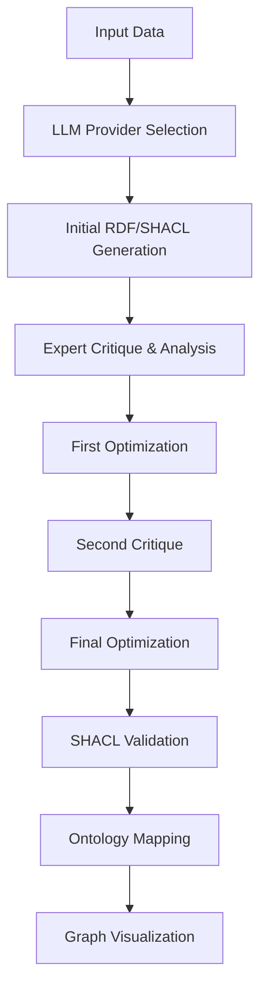

# 🔬 RDF & SHACL Generator Using LLM

A sophisticated Streamlit application that transforms unstructured mechanical test data (particularly creep tests) into standardized RDF (Resource Description Framework) and SHACL (Shapes Constraint Language) representations using Large Language Models. This tool bridges materials science domain knowledge with semantic web technologies to create interoperable knowledge graphs.

[View live website here](https://llm-rdf-shacl-creation-5623b0cfb7c0.herokuapp.com/)

## ✨ Features

### Core Functionality
- **Multi-LLM Support**: Compatible with OpenAI GPT models, Anthropic Claude, and self-hosted Ollama models
- **Iterative Refinement**: Three-stage self-correction process for improved output quality
- **SHACL Validation**: Built-in validation to ensure RDF conforms to generated SHACL shapes
- **Interactive Visualization**: Dynamic graph visualization using NetworkX and Pyvis
- **Ontology Mapping**: Intelligent suggestions for mapping data to established materials science ontologies

### Advanced Features
- **Expert System Prompting**: Specialized prompts designed by materials science knowledge engineers
- **Comprehensive Validation**: Multi-stage validation with detailed error reporting
- **Export Capabilities**: Download generated RDF and SHACL files
- **Example Data**: Built-in creep test example for quick testing
- **Temperature Control**: Adjustable model temperature for creativity vs. precision balance

## 🚀 Quick Start

### Prerequisites

- Python 3.8 or higher
- API keys for your chosen LLM provider (OpenAI, Anthropic, or local Ollama installation)

### Installation

1. **Clone the repository**:
```bash
git clone <repository-url>
cd rdf-shacl-generator
```

2. **Install dependencies**:
```bash
pip install -r requirements.txt
```

3. **Create environment file** (optional):
```bash
cp .env.example .env
# Edit .env with your API keys
```

4. **Run the application**:
```bash
streamlit run rdf_shacl_reflection_streamlit.py
```

5. **Access the app**: Open your browser to `http://localhost:8501`

## 📦 Dependencies

### Core Libraries
```python
streamlit>=1.28.0
openai>=1.0.0
anthropic>=0.21.0
rdflib>=7.0.0
pyshacl>=0.25.0
networkx>=3.1
pyvis>=0.3.2
python-dotenv>=1.0.0
requests>=2.31.0
```

### System Requirements
- **Memory**: Minimum 2GB RAM (4GB+ recommended for large datasets)
- **Storage**: 100MB for dependencies, additional space for generated files
- **Network**: Internet connection required for API-based LLM providers

## 🔧 Configuration

### API Keys Setup

#### Option 1: Sidebar Input (Recommended)
1. Launch the application
2. Enter your API keys in the sidebar:
   - **OpenAI**: Get from [OpenAI Platform](https://platform.openai.com/api-keys)
   - **Anthropic**: Get from [Anthropic Console](https://console.anthropic.com/)
   - **Ollama**: Configure local endpoint (default: `http://localhost:11434`)

#### Option 2: Environment Variables
Create a `.env` file in the project root:
```env
OPENAI_API_KEY=your_openai_api_key_here
ANTHROPIC_API_KEY=your_anthropic_api_key_here
```

### Model Selection

#### OpenAI Models
- **gpt-4o**: Latest and most capable model
- **gpt-4o-mini**: Faster and more cost-effective
- **gpt-4-turbo**: Balanced performance and speed

#### Anthropic Models  
- **claude-3-7-sonnet-20250219**: Most intelligent model (recommended)
- **claude-3-5-haiku-20241022**: Fastest for daily tasks

#### Ollama Models (Self-hosted)
- **llama3.3:70b-instruct-q8_0**: High-quality instruction following
- **qwen3:32b-q8_0**: Balanced performance
- **phi4-reasoning:14b-plus-fp16**: Specialized reasoning capabilities

## 📊 Usage Guide

### Step 1: Input Data
1. **Choose input method**:
   - Use example data (BAM 5.2 creep test)
   - Paste your own mechanical test data
2. **Supported formats**: JSON, structured text, test reports

### Step 2: Configure LLM
1. Select your LLM provider
2. Choose appropriate model
3. Adjust temperature (0.0 = deterministic, 1.0 = creative)

### Step 3: Generate & Refine
1. Click "Generate RDF & SHACL"
2. Review initial output
3. Analyze iterative improvements
4. Examine final validated results

### Step 4: Validation & Export
1. Check SHACL validation results
2. Download RDF and SHACL files
3. Review ontology term suggestions
4. Explore interactive graph visualization

## 🏗️ Architecture

### Processing Pipeline



### Key Components

#### 1. Expert System Prompt
- Materials science domain expertise
- Structured reasoning methodology
- Ontology alignment guidelines
- Best practices enforcement

#### 2. Iterative Refinement Engine
- Three-stage improvement process
- Expert critique at each stage
- Cumulative enhancement tracking
- Quality assessment metrics

#### 3. Validation Framework
- Syntax validation for RDF/SHACL
- Semantic consistency checking
- Domain-specific constraint verification
- Comprehensive error reporting

#### 4. Visualization Engine
- NetworkX graph processing
- Pyvis interactive rendering
- Node/edge optimization
- Navigation controls

## 🎯 Ontology Coverage

### Supported Ontologies
- **EMMO**: European Materials Modelling Ontology
- **MATWERK**: Materials Workflow Ontology
- **PMDcore**: Physical Materials Data Core
- **NFDI Core**: National Research Data Infrastructure
- **IAO**: Information Artifact Ontology
- **OBI**: Ontology for Biomedical Investigations
- **QUDT**: Quantities, Units, Dimensions and Types
- **PROV**: Provenance Ontology

### Entity Types Modeled
- Material samples and composition
- Test equipment and calibration
- Experimental procedures and protocols
- Measurements and observations
- Temporal relationships
- Provenance and traceability

## 📈 Example Output

### Sample RDF (Turtle Format)
```turtle
@prefix rdf: <http://www.w3.org/1999/02/22-rdf-syntax-ns#> .
@prefix matwerk: <http://matwerk.org/ontology#> .
@prefix qudt: <http://qudt.org/schema/qudt/> .
@prefix unit: <http://qudt.org/vocab/unit/> .

ex:sample_Vh5205_C-95 a matwerk:MaterialSample ;
    rdfs:label "CMSX-6 Creep Test Specimen" ;
    matwerk:hasComposition ex:cmsx6_composition ;
    matwerk:hasGeometry ex:round_geometry .

ex:creep_test_001 a matwerk:CreepTest ;
    rdfs:label "High Temperature Creep Test" ;
    matwerk:hasTemperature ex:temp_980C ;
    matwerk:hasStress ex:stress_140MPa .
```

### Sample SHACL Shape
```turtle
@prefix sh: <http://www.w3.org/ns/shacl#> .

ex:MaterialSampleShape a sh:NodeShape ;
    sh:targetClass matwerk:MaterialSample ;
    sh:property [
        sh:path matwerk:hasComposition ;
        sh:minCount 1 ;
        sh:maxCount 1 ;
    ] .
```

## 🔧 Troubleshooting

### Common Issues

#### API Connection Errors
- **Symptom**: "API key not provided" or connection timeouts
- **Solution**: Verify API keys in sidebar, check internet connection
- **For Ollama**: Ensure local server is running on specified endpoint

#### Validation Failures
- **Symptom**: "RDF does NOT conform to SHACL"
- **Solution**: Review generated constraints, check data types and cardinalities
- **Debug**: Use validation report details to identify specific issues

#### Visualization Problems
- **Symptom**: Graph not displaying or appears empty
- **Solution**: Ensure RDF contains valid triples, refresh browser
- **Performance**: Large graphs may take time to render

#### Memory Issues
- **Symptom**: Application crashes or becomes unresponsive
- **Solution**: Reduce input data size, restart application
- **Optimization**: Use more efficient models (e.g., gpt-4o-mini)

### Performance Optimization

#### Model Selection
- **Fast prototyping**: Use Haiku or gpt-4o-mini
- **Production quality**: Use Claude-3-7-sonnet or gpt-4o
- **Cost optimization**: Use Ollama for local processing

#### Input Optimization
- **Structure data**: Well-formatted input improves output quality
- **Size limits**: Keep inputs under 10,000 characters for best performance
- **Clarity**: Clear, unambiguous data descriptions yield better results

## 🚦 API Usage & Costs

### OpenAI Pricing (Approximate)
- **GPT-4o**: ~$5-15 per 1M tokens
- **GPT-4o-mini**: ~$0.15-0.60 per 1M tokens
- **Typical session**: 10,000-50,000 tokens ($0.05-2.50)

### Anthropic Pricing (Approximate)
- **Claude-3-7-sonnet**: ~$3-15 per 1M tokens
- **Claude-3-5-haiku**: ~$0.25-1.25 per 1M tokens
- **Typical session**: 10,000-50,000 tokens ($0.03-2.00)

### Ollama (Self-hosted)
- **Cost**: Free after initial setup
- **Requirements**: 8GB+ RAM for 7B models, 16GB+ for 13B models
- **Performance**: Slower than cloud APIs but private and cost-effective

## 🛡️ Security & Privacy

### Data Handling
- **API Data**: Sent to respective LLM providers (OpenAI/Anthropic)
- **Local Processing**: Ollama processes data locally
- **No Storage**: Application doesn't persist user data
- **Privacy**: Review provider privacy policies for API usage

### Best Practices
- **Sensitive Data**: Use Ollama for confidential materials data
- **API Keys**: Store securely, never commit to version control
- **Network**: Use HTTPS endpoints, consider VPN for sensitive work

## 🤝 Contributing

### Development Setup
1. Fork the repository
2. Create feature branch: `git checkout -b feature/new-feature`
3. Install development dependencies: `pip install -r requirements-dev.txt`
4. Make changes and test thoroughly
5. Submit pull request with detailed description

### Code Style
- **Python**: Follow PEP 8 guidelines
- **Comments**: Document complex logic and domain-specific concepts
- **Testing**: Include unit tests for new functionality
- **Documentation**: Update README for significant changes

### Areas for Contribution
- Additional ontology support (ChEBI, FAIR-IMPACT)
- Enhanced visualization options
- Performance optimizations
- Unit test coverage
- Documentation improvements

## 📄 License

This project is licensed under the MIT License - see the LICENSE file for details.

## 🙏 Acknowledgments

- **Materials Science Community**: For domain expertise and requirements
- **Semantic Web Community**: For ontology standards and best practices
- **Open Source Libraries**: RDFLib, PySHACL, NetworkX, Streamlit teams
- **LLM Providers**: OpenAI, Anthropic, and Ollama communities

## 📞 Support

### Getting Help
- **Issues**: Create GitHub issue with detailed description
- **Discussions**: Use GitHub Discussions for questions and ideas
- **Documentation**: Check this README and inline code comments
- **Community**: Join materials informatics forums and Semantic Web communities

### Reporting Bugs
Please include:
- Python version and OS
- Complete error messages
- Steps to reproduce
- Sample input data (if not sensitive)
- Expected vs. actual behavior

---

**Built with ❤️ for the Materials Science and Semantic Web communities**
